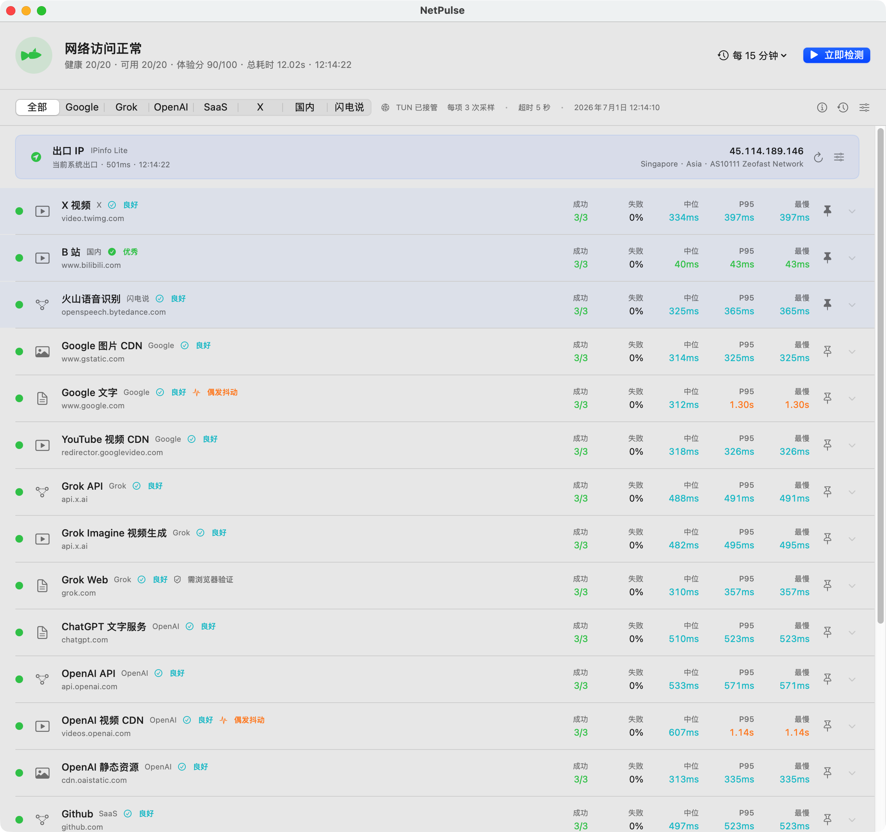
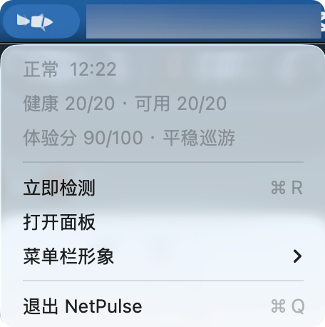

# NetPulse

<p align="center">
  <strong>English</strong> · <a href="README.zh-CN.md">简体中文</a>
</p>

NetPulse is a native macOS menu bar network monitor for travel, VPNs, proxy chains, and complex office networks. It performs real HTTP requests against text, image, video CDN, and API endpoints to expose failures that simple connectivity checks miss, such as a website loading while its images or videos remain unavailable.

<p align="center">
  
</p>



<p align="center">
  
</p>

## Lightweight by Design

NetPulse uses native SwiftUI and on-demand probes. While idle, it keeps only its menu bar state and a sleeping scheduler. At each configured interval it runs a small batch of samples, saves the results locally, and returns to sleep. Video checks read only a small byte range rather than downloading the full video, keeping CPU, bandwidth, and battery usage low.

## Sailfish in the Menu Bar

The default brand character is a sailfish: fast, distinctive, and readable even at menu bar size. Its long bill, tall sail-like dorsal fin, and crescent tail create a clear silhouette. Swimming speed maps directly to the current network experience, while the dashboard and menu bar share the same visual language. Other aquarium characters remain available in settings.

- During a check, the sailfish swims at its fastest pace.
- On a healthy network, it cruises smoothly.
- On a slower network, its movement becomes more relaxed.
- When services are unavailable, it keeps a subtle motion without creating unnecessary anxiety.

## Features

- Concurrent checks for Google, X, ChatGPT/OpenAI, Grok/xAI, and custom services.
- Separate probes for text, images, video CDNs, and APIs.
- Success rate, sample failure rate, median, P95, and worst latency.
- Median-based typical experience with visible P95 tail-latency warnings.
- DNS, TCP, TLS, time-to-first-byte, and total request timing.
- Historical comparison of resolved CDN addresses to identify bad proxy or CDN paths.
- Shadowrocket suggestions for node switching, temporary host mapping, and X domain rules.
- Recognition of Shadowrocket TUN/Fake-IP addresses in `198.18.0.0/15`.
- Service grouping, target enablement, custom targets, editing, and pinning.
- One-target checks without triggering a complete run.
- Presets for 1, 5, 15, and 30 minutes plus a custom 1–1440 minute interval.
- macOS failure and recovery notifications with launch-at-login support.
- Local storage for the latest 50 runs.
- Import and export of shareable JSON configuration packages.
- Optional public exit IP, country, and ASN display through IPinfo Lite.

## Requirements

- macOS 13 or later
- Xcode Command Line Tools for source builds
- Swift 5.10 or later for source builds

## Installation

### GitHub Release

Each version tag is built automatically by GitHub Actions:

```text
NetPulse-<version>-universal.dmg
NetPulse-<version>-universal.dmg.sha256
```

The Universal DMG supports both Apple Silicon and Intel Macs. Every DMG includes a SHA-256 checksum and a GitHub Artifact Attestation that links the artifact to this repository, release workflow, and source commit.

After downloading:

```bash
shasum -a 256 -c NetPulse-<version>-universal.dmg.sha256
gh attestation verify NetPulse-<version>-universal.dmg \
  --repo futeng/NetPulse
```

When both checks pass, open the DMG and drag `NetPulse.app` into Applications.

NetPulse currently has no paid Apple Developer certificate. Release builds are therefore **ad-hoc signed and not Apple-notarized**. On first launch:

1. Control-click NetPulse in Finder's Applications folder.
2. Select **Open**, then confirm **Open** again.
3. If macOS still blocks it, open **System Settings → Privacy & Security** and select **Open Anyway** for NetPulse.

This is normally required only once. See [`docs/DISTRIBUTION.md`](docs/DISTRIBUTION.md) for the security model and limitations.

### Build from Source

Build for the current Mac architecture and install into `~/Applications`:

```bash
./scripts/install_netpulse_app.sh
```

Build without installing:

```bash
./scripts/build_netpulse.sh
```

Build a specific architecture or a Universal app:

```bash
./scripts/build_netpulse.sh arm64
./scripts/build_netpulse.sh x86_64
./scripts/build_netpulse.sh universal
```

Generate and verify a local Universal DMG:

```bash
./scripts/build_release_dmg.sh universal
./scripts/verify_release_dmg.sh
```

Build output is written to `dist/NetPulse.app`. After installation, open the dashboard from the menu bar or run:

```bash
open netpulse://dashboard
```

Allow notifications under **System Settings → Notifications → NetPulse** after first launch.

Early test builds used a different Bundle ID. After upgrading to `com.ftpai.futeng.NetPulse`, macOS may ask for notification and launch-at-login permission again. Existing targets and history remain in the same Application Support directory.

## Usage

The dashboard shows the latest check directly:

- Filter by service group, such as Google, X, OpenAI, or Grok.
- Pin important targets to move them to the top with a distinct background.
- Expand a row to inspect timing stages and route information.
- Run only that target from its expanded detail view.
- Choose a preset, custom interval, or disable scheduled checks from the top-right menu.
- Open history and configuration from the right side of the list toolbar.
- Export or import a JSON configuration package from the configuration menu.
- Configure an IPinfo Lite token under runtime settings to show the current system exit IP, country, and ASN.

Target fields map to the list as follows:

| Field | Purpose |
|---|---|
| Service group | Creates the top filter and identifies the owning service |
| Target name | Main title displayed in the target list |
| Content type | Selects the text, image, video, API, or custom icon |
| Domain or URL | Actual endpoint requested by the probe |

Built-in and custom targets can both be edited. Each target row keeps only pin and overflow controls; enable, disable, edit, and delete actions live in the overflow menu. Restoring built-in targets is intentionally placed in the less prominent configuration menu.

Default behavior:

- Run every 5 minutes.
- Sample each target three times.
- Process up to three targets concurrently with staggered starts to avoid creating a proxy or TLS burst.
- Use a 5-second timeout per request.
- Suppress duplicate notifications of the same type for 30 minutes.

The built-in Grok checks avoid paid usage: the Web target checks `grok.com`, the Imagine target checks the xAI video-generation entry point, and the API target checks the unauthenticated model-list response.

Exported configuration contains targets and shareable runtime settings. It excludes history, launch-at-login state, and the local IPinfo token.

IPinfo Lite is currently the only exit-IP provider. Its free plan requires an API token, which is stored only in the local `config.json`.

### Performance Levels

| Level | Median total latency |
|---|---:|
| Excellent | `< 300ms` |
| Good | `300–799ms` |
| Slow | `800–1499ms` |
| Very slow | `>= 1500ms` |

Any failed or timed-out sample takes priority and marks the target as unstable. If every sample fails, the target is unavailable.

## Development

Run tests:

```bash
swift test --package-path NetPulse
```

Regenerate the application icon from the brand source:

```bash
./scripts/generate_app_icon.sh
```

Project structure:

```text
NetPulse/
  Package.swift
  Resources/Info.plist
  Sources/NetPulse/
  Tests/NetPulseTests/
docs/ARCHITECTURE.md
docs/DISTRIBUTION.md
scripts/build_netpulse.sh
scripts/build_release_dmg.sh
scripts/generate_app_icon.sh
scripts/install_netpulse_app.sh
scripts/verify_release_dmg.sh
```

See [`docs/ARCHITECTURE.md`](docs/ARCHITECTURE.md) for architecture and data flow.

### Intel Macs

An Intel Mac running macOS 13 or later can clone and run the project directly:

```bash
./scripts/install_netpulse_app.sh
```

The script selects `x86_64` through `uname -m`. Apple Silicon Macs can also cross-compile the Intel slice with an installed macOS SDK.

### Create a Release

Push a `v*` tag to trigger the Universal DMG release:

```bash
git tag v1.0.0
git push origin v1.0.0
```

The release workflow verifies SHA-256, DMG integrity, the ad-hoc signature, Bundle ID, and both `arm64` and `x86_64` slices before generating a GitHub Artifact Attestation. A failed check prevents Release creation.

## Data and Privacy

- Configuration and history stay under `~/Library/Application Support/NetPulse/`.
- `198.18.x.x` and `198.19.x.x` are reserved virtual addresses used by proxy software, not the Mac's public IP.
- Probes make a small number of real requests. Video targets read only a small byte range.
- NetPulse collects no telemetry and contains no third-party messaging credentials.
- Bundle ID: `com.ftpai.futeng.NetPulse`.

## License

NetPulse is available under the [MIT License](LICENSE).
